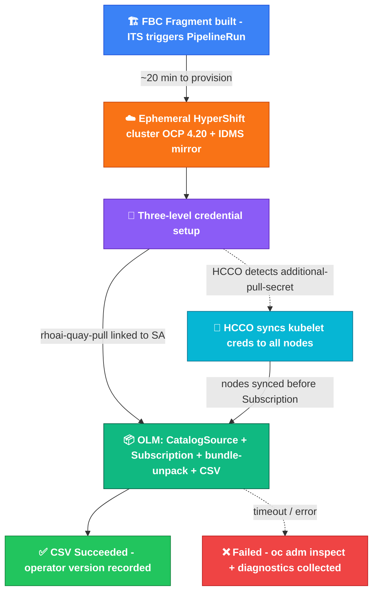

# olminstall Integration Test Scenario

End-to-end Konflux integration test for ODH/RHOAI operator installation via OLM. Provisions an ephemeral **HyperShift** cluster using [Konflux EaaS](https://konflux.pages.redhat.com/docs/users/testing/cluster-provisioning.html#methods), installs the operator from the **FBCF catalog image** in the Konflux snapshot, and verifies the CSV reaches `Succeeded`.

References: [RHOAIENG-57712](https://redhat.atlassian.net/browse/RHOAIENG-57712).

## Pipeline flow



> **IDMS mirror:** `registry.redhat.io/rhoai` → `quay.io/rhoai` — FBC references bundle images under `registry.redhat.io` but they only exist on `quay.io`.
>
> **Three credential levels:** (a) global `pull-secret` in `openshift-config` — the only OCP-supported auth for IDMS mirrors; (b) `additional-pull-secret` in `kube-system` — HCCO trigger; (c) `rhoai-quay-pull` in `openshift-marketplace` — SA `imagePullSecret` for direct CatalogSource pod pulls.
>
> **HCCO node sync:** HyperShift's Hosted Cluster Config Operator detects `additional-pull-secret` and deploys `global-pull-secret-syncer` DaemonSet in `kube-system`. Each pod writes `/var/lib/kubelet/config.json` and restarts kubelet via DBus — propagating creds **without node replacement**. Required because CRI-O < 1.34 ([cri-o/cri-o#4941](https://github.com/cri-o/cri-o/issues/4941)) does not forward pod `imagePullSecrets` to IDMS mirror pulls, but kubelet-level creds apply to all pulls.
>
> **Bundle-unpack:** OLM pulls `odh-operator-bundle@sha256:…` via the IDMS mirror using kubelet credentials (not pod-level secrets), so the redirect to `quay.io/rhoai` succeeds.

## What it does

1. **Parses the snapshot** — extracts the FBCF `containerImage` for the configured `FBCF_COMPONENT_NAME`.
2. **provision-eaas-space** — reserves an EaaS environment.
3. **provision-cluster** — picks a supported OpenShift version and creates an ephemeral HyperShift cluster (AWS, `m5.2xlarge` by default). Configures an IDMS mirror: `registry.redhat.io/rhoai` → `quay.io/rhoai`.
4. **install-operator** — runs two scripts against the provisioned cluster:
   - `patch-cluster-pull-secret.sh`: merges `quay.io/rhoai` credentials into the cluster pull secret, creates an `additional-pull-secret` in `kube-system` for HCCO node sync (see [Auth strategy](#auth-strategy-for-idms-mirrors)), and creates `rhoai-quay-pull` in `openshift-marketplace`.
   - `install-and-verify.sh`: creates the CatalogSource, waits for HCCO to sync credentials to all nodes, creates the Subscription, approves the InstallPlan, and waits for the CSV to reach `Succeeded`.
5. **post-results** — sends a Slack notification (if `SLACK_WEBHOOK_URL` is configured) and writes `TEST_OUTPUT`.
6. **collect-diagnostics** _(on failure)_ — runs `oc adm inspect` on the operator namespace and relevant OLM resources.

## Files

| File | Purpose |
|------|---------|
| [`olminstall-smoke-pipeline.yaml`](olminstall-smoke-pipeline.yaml) | Pipeline: snapshot → EaaS cluster → install → verify |
| [`olminstall-operator-task.yaml`](olminstall-operator-task.yaml) | Reusable Task: patch pull secrets, install operator, verify CSV |
| [`its-olminstall.yaml`](its-olminstall.yaml) | `IntegrationTestScenario` for ODH (`open-data-hub-tenant`, `odh-operator-catalog` component) |
| [`its-olminstall-rhoai-testops.yaml`](its-olminstall-rhoai-testops.yaml) | `IntegrationTestScenario` for RHOAI sandbox testing (`rhoai-tenant`, `rhoai-fbc-fragment-ocp-421`) |
| [`scripts/patch-cluster-pull-secret.sh`](scripts/patch-cluster-pull-secret.sh) | Injects `quay.io/rhoai` credentials into the EaaS cluster at all required levels |
| [`scripts/install-and-verify.sh`](scripts/install-and-verify.sh) | Creates OLM resources, waits for CSV `Succeeded`, writes `INSTALL_STATUS` |
| [`test-snapshot.yaml`](test-snapshot.yaml) | Example Snapshot for manual pipeline trigger |
| [`test-pipelinerun.yaml`](test-pipelinerun.yaml) | Example PipelineRun for local/manual execution |

## Tenant and application

[`its-olminstall.yaml`](its-olminstall.yaml) targets **`open-data-hub-tenant`**, application **`opendatahub-builds`**, context `component_odh-operator-catalog`, triggering on ODH FBCF builds.

[`its-olminstall-rhoai-testops.yaml`](its-olminstall-rhoai-testops.yaml) targets **`rhoai-tenant`**, application **`rhoai-fbc-fragment-ocp-421`**, used for development iteration and sandbox testing of the RHOAI FBC fragment builds.

## Auth strategy for IDMS mirrors

The RHOAI operator bundle images are referenced in the FBC as `registry.redhat.io/rhoai/odh-operator-bundle@sha256:...` but are only accessible at `quay.io/rhoai/`. The pipeline configures an IDMS mirror at cluster provisioning to redirect `registry.redhat.io/rhoai` → `quay.io/rhoai`.

However, OLM's bundle-unpack job runs on a worker node via CRI-O, and CRI-O < 1.34 (OCP ≤ 4.20) has a known bug ([cri-o/cri-o#4941](https://github.com/cri-o/cri-o/issues/4941)): **pod-level `imagePullSecrets` are not forwarded to IDMS mirror registry pulls**. OpenShift documentation explicitly states that for IDMS mirror registries, only the cluster-wide global pull secret is supported — not project or pod pull secrets.

In a standard cluster, updating the global pull secret propagates via the Machine Config Operator (MCO). In HyperShift, MCO changes trigger **node replacement** (not in-place update), which takes 15-30 minutes — too slow for an ephemeral integration test.

**Solution:** `patch-cluster-pull-secret.sh` creates a secret named `additional-pull-secret` in `kube-system`. HyperShift's **Hosted Cluster Config Operator (HCCO)** automatically detects this secret and deploys a `global-pull-secret-syncer` DaemonSet in `kube-system` that:
- Merges credentials into `/var/lib/kubelet/config.json` on each node
- Restarts kubelet via systemd DBus

This is the **official HyperShift mechanism** for propagating pull-secret changes without node replacement. `install-and-verify.sh` waits for the syncer to complete on all nodes before creating the Subscription.

> **Note:** Use namespace-specific credential keys (e.g. `quay.io/rhoai`) rather than bare `quay.io` in `additional-pull-secret`. HCCO applies original-pull-secret entries with higher precedence on conflict, so namespace-specific keys avoid being overridden.

## BVT (Build Verification Tests)

**Not implemented yet.** The ticket asks for BVT after deployment; the suite and entrypoint are still open. Reasonable follow-ups (agree with TestOps):

- Run a dedicated image with the same commands as an existing Jenkins BVT job.
- Clone a QE repo and run pytest/go tests (similar to [`opendatahub-operator/e2e-test.yaml`](../opendatahub-operator/e2e-test.yaml)).
- Agree on a minimal gate (e.g. DSC CR smoke) for a first iteration.

## Slack notifications (optional)

The `post-results` task posts to Slack when **`SLACK_WEBHOOK_URL`** is set. Create an optional Secret in the tenant namespace:

```
Name: olminstall-slack-webhook
Key:  webhook-url   (full Slack incoming webhook URL)
```

If the Secret is absent, the step logs the message and exits without failing the run.

## Manual trigger

Apply the ITS first, then create a Snapshot to trigger a pipeline run:

```bash
oc apply -n rhoai-tenant -f integration-tests/olminstall/its-olminstall-rhoai-testops.yaml
oc create -n rhoai-tenant -f integration-tests/olminstall/test-snapshot.yaml
```

To monitor:
```bash
tkn pipelinerun logs -n rhoai-tenant --last -f
```

## Parameters (Pipeline)

| Parameter | Default | Description |
|-----------|---------|-------------|
| `FBCF_COMPONENT_NAME` | `odh-operator-catalog` | Snapshot component name for the FBCF catalog image (ITS overrides to `rhoai-fbc-fragment-ocp-421` for RHOAI) |
| `UPDATE_CHANNEL` | `stable` | OLM subscription channel |
| `OPERATOR_NAMESPACE` | `opendatahub-operators` | Namespace for operator installation |
| `OPERATOR_NAME` | `rhods-operator` | OLM package name (use `rhods-operator` for RHOAI, `opendatahub-operator` for ODH) |
| `HYPERSHIFT_INSTANCE_TYPE` | `m5.2xlarge` | AWS worker instance type for the ephemeral cluster |
| `SCRIPTS_REPO_URL` | `https://github.com/manosnoam/odh-konflux-central.git` | Git repo containing the step scripts (change to the upstream org URL after merge) |
| `SCRIPTS_REPO_REVISION` | `add-olminstall-its` | Branch/SHA for the scripts repo (update to `main` after merge) |
